<h1 align="center"> Fase 3: Creación API REST </h1>

## Ejecución

Para ejecutar el proyecto en Docker se debe realizar lo siguiente:

# 1. Construir el contenedor

<h1 align="center"> Fase 2: Despliegue de Modelo en Contenedor </h1>

## Modificación Scripts

El script generado en la parte inicial del curso es modificado en dos archivos de tal forma que el archivo original pueda ser llamado desde otro central Nombrado Run_scripts.
En este script se llaman los arhivos Necesarios para entrenar y predecir, asi como un archivo de salida de predicciones y otro que permita cargar un modelo.

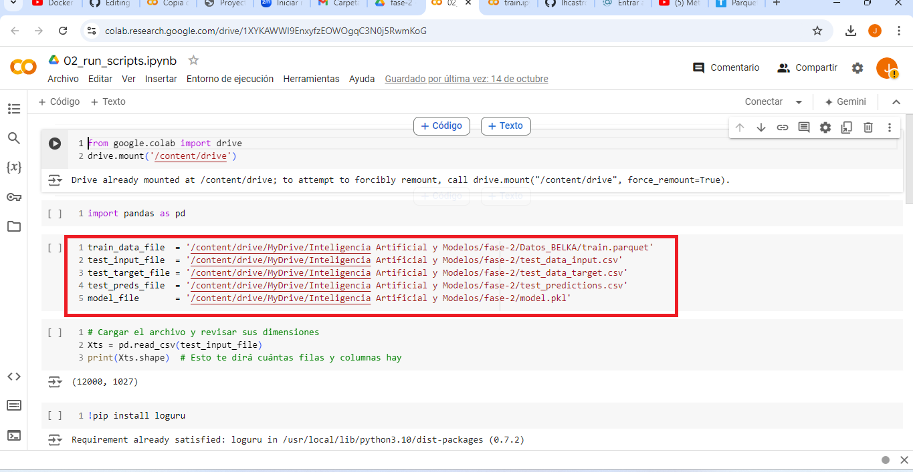

Una vez se tienen los archivos requeridos el script ejecuta los scripts .py para entrenar (train.py) y para predecir (predict.py), los cuales usan los archivos requeridos según el caso.

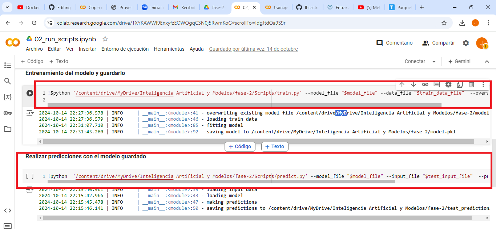

El Script Train.py como se ha mencionado antes, recibe el Archivo con datos para llevar a cabo el entrenamiento y tiene como salida el modelo, el cual es sobre escrito tras el entrenamiento.

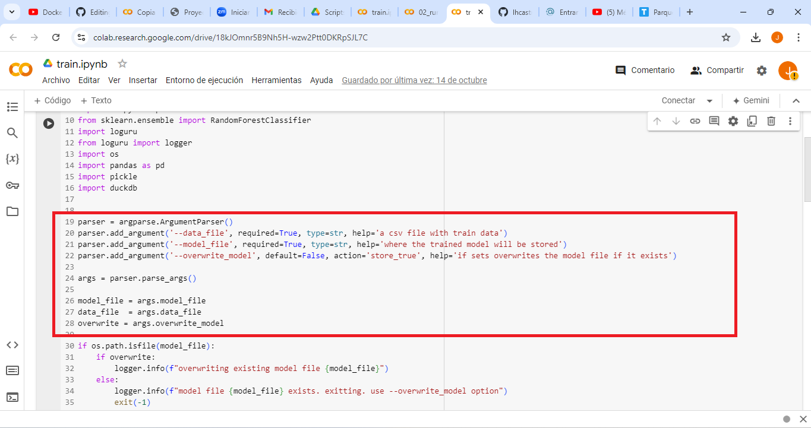

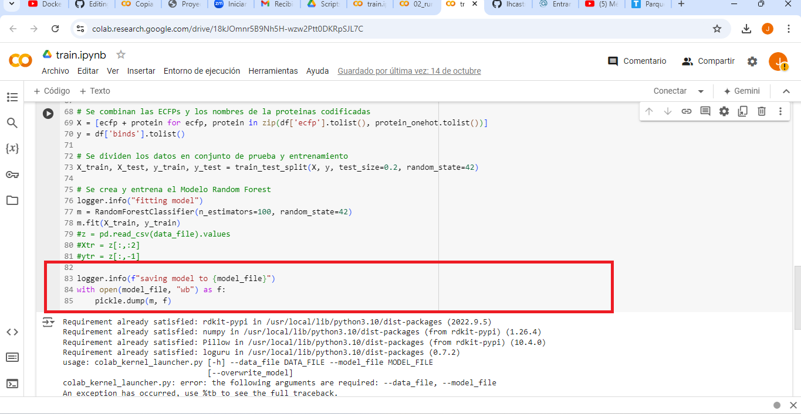

Para el caso de Predic.py, se recibe tanto el archivo que tiene el modelo cargado como los datos de predicción. La salida del script es un archivo .csv con las respectivas predicciones.

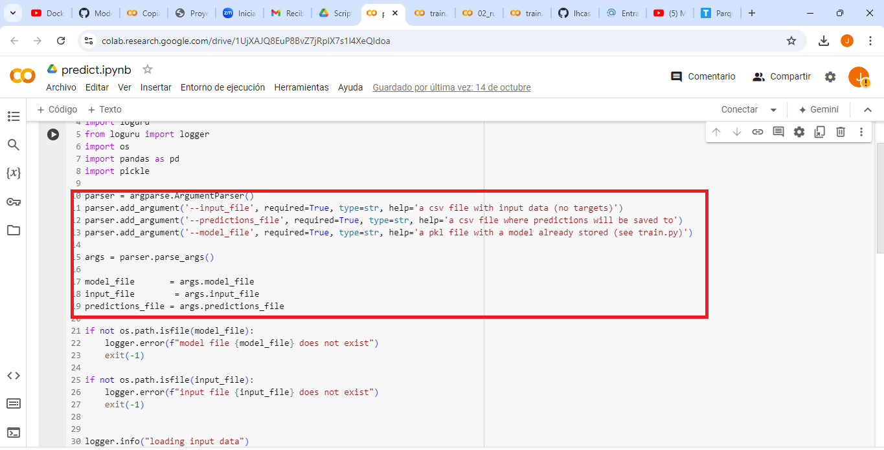

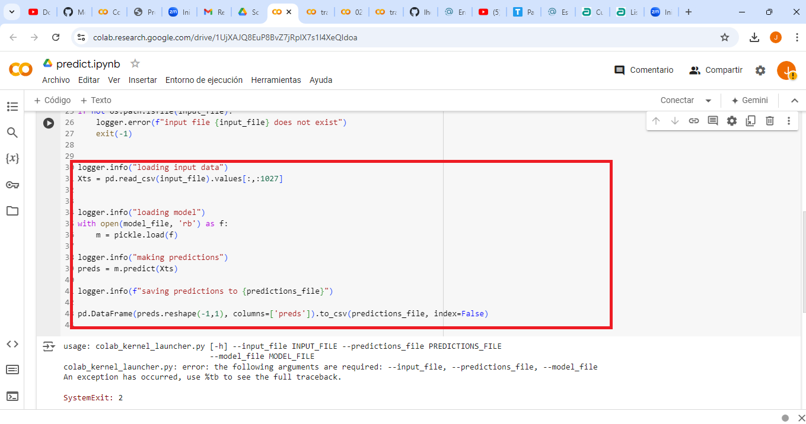

## Creación de Docker

Inicialmente se crea el DockerFile y se configura el archivo requirements.txt. El Dockerfile es usado para la creación del contenedor y el de requirements.txt tiene las dependencias necesarias para la ejecución de los scripts. Adicionalmente, se instalan unas librerías necesarias para que al dependencia rdkit pueda ejecutarse.

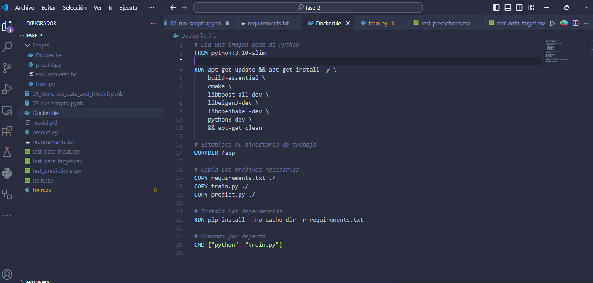

Posteriormente, se obtiene la imagen del contenedor para la ejecución.

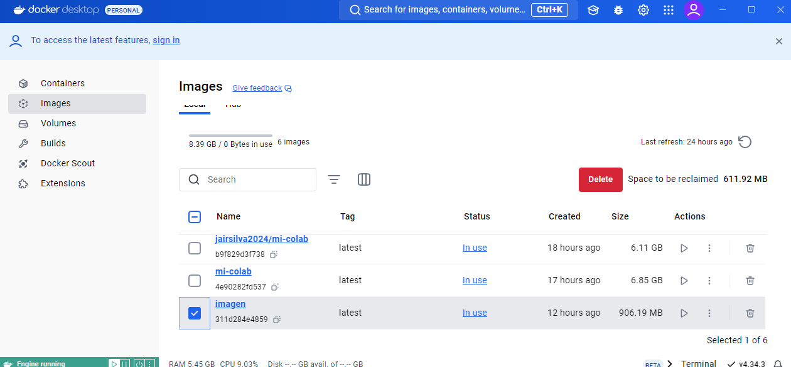

## Obtención Base Datos de entrenamiento

En la fase 1 del Proyecto se usaba una base de datos con una cantidad enorme de datos, lo cual dificultaba su posible subida a Github. Para poder llevar a cabo el entrenamiento se obtiene una nueva base de datos con 900.000 datos, para lo cual se obtiene un archico .csv que obtiene dichos datos aleatorios de la base original.

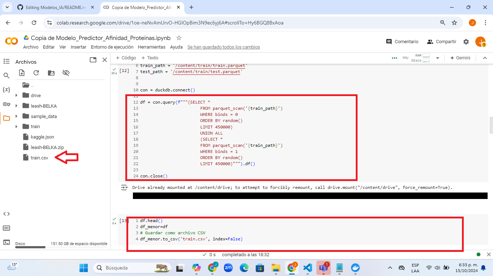

## Prueba de ejecución - Entrenamiento

Inicialmente se tiene una base de datos de entrenamiento, que se obtiene como ya se había mencionado. Se entrena el modelo con la base de datos, y se sobre escribe el archivo original de modelo. Para el caso de local se usa el siguiente código: docker run -v (RUTA LOCAL PROYECTO):/app/data imagen2 python /app/data/Scripts/train.py --data_file /app/data/train.csv --model_file /app/data/model.pkl --overwrite_model

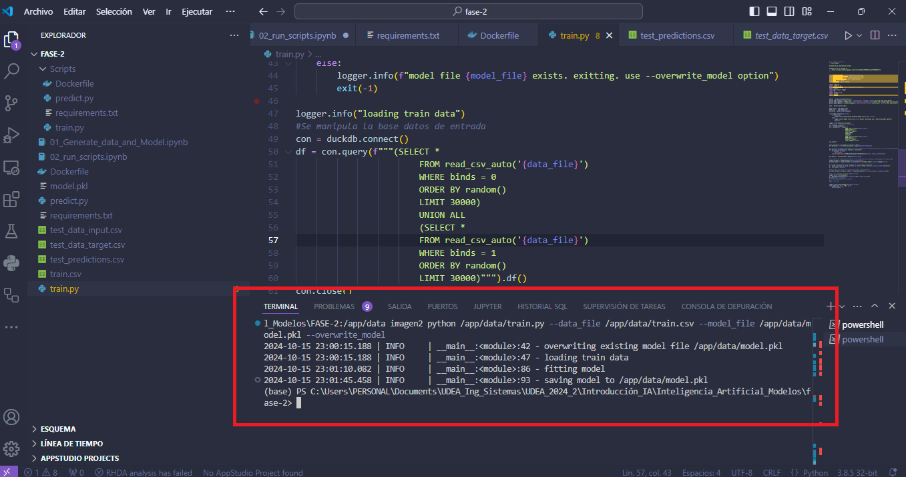

## Prueba de ejecución - Predicción

Inicialmente se guarda un modelo, y se lleva a cabo la predicción de afinidades usando docker. Para el caso de local se usa el siguiente código: docker run -v (RUTA LOCAL PROYECTO):/app/data imagen2 python /app/data/predict.py --input_file /app/data/test_data_input.csv --model_file /app/data/model.pkl --predictions_file /app/data/test_predictions.csv

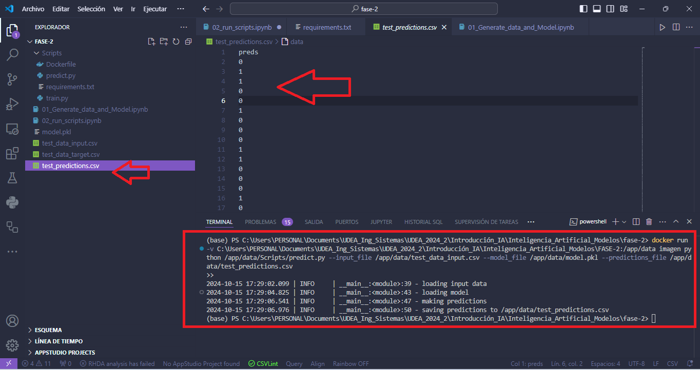

<h1 align="center"> Proyecto_Sustituto_Inteligencia_Artificial </h1>

## Contexto

En el siguiente proyecto se utilizó una solución disponible para la Competición de Kaggle llamada "NeurIPS 2024 - Predict New Medicines with BELKA". La competición buscaba el uso de Modelos de Machine Learning para predecir la afinidad entre moleculas pequeñas y determinadas proteinas objetivo usando la Gran Biblioteca Codificada para la Evaluación Quimica (BELKA).

La predicción de afinidad de las moleculas pequeñas a ciertas proteínas es fundamental para el desarrollo de medicina en la industria farmaceutica. Para el caso de la competición se usará una parte de los datos obtenidos experimentalmente en pruebas realizadas por Leash Bioscience, los cuales se encuentran en la BELKA.

BELKA es una Gran Biblioteca Codificada para la Evaluación Química que contiene aproximadamente 3.6 mil millones de mediciones de unión física entre 3.6 mil millones de moléculas pequeñas y 3 proteinas objetivo utilizando la tecnologia de biblioteca química codificada por ADN. 

El desarrollo de un modelo de Machine Learning adecuado sería util para el descubrimiento de nuevos fármacos ya que permite realizar una preselección de medicamentos candidatos con determinadas proteinas objetivo, disminuyendo de manera drastica la cantidad de pruebas de laboratorio que se deben realizar, optimizando tiempo y reduciendo costos en experimentación.

Para la competición en específico se modelará la afinidad de diferentes moléculas en 3 proteínas: EPHX2 (sEH), BRD4 y ALB (HSA). Estas proteínas estan relacionadas con presión arterial alta, progresión de diabetes y cancer. La base de datos suministrada se encuentra en un archivo .paquet, y contiene la información de las moleculas en notación SMILES (Simplified Molecular Input Line Entry System), la cual es usada para uso computacional. La base de datos tiene como salida 0 o 1, indicando si hay afinidad o no por parte de las moleculas a las 3 proteínas.

## Codigo

De las soluciones encontradas para el desafio se escogió la mejor calificada. Dicha solución tal como se ve en la siguiente imagen se puede consultar en el siguiente enlace https://www.kaggle.com/code/andrewdblevins/leash-tutorial-ecfps-and-random-forest: 

En resumen, La solución encontrada consiste en tomar la información de las moléculas codificadas en SMILES, la transforma en ECFPs (Extended-connectivity fingerprints), y posteriormente en vectores que son usados para entrenar el modelo usando el clasificador de random Forest. 

El codigo disponible se ejecutó en la herramienta Google Colab, y se puede acceder a través del siguiente enlace: https://colab.research.google.com/drive/1TFxXRKhgDSLkFGkjLCTNdW86vjXow0LB?usp=sharing

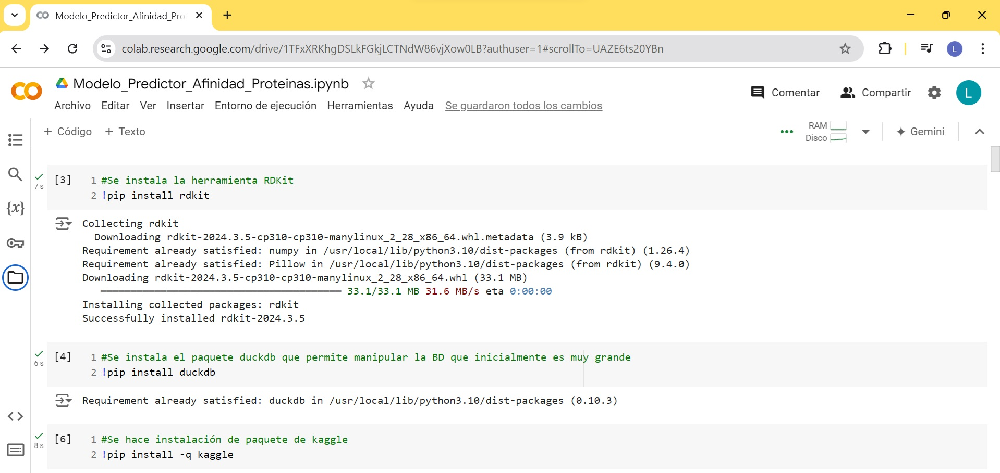

Para la manipulación de la base de datos se usa la librería duckdb, y para manipular la información de moléculas suministrada en la base de datos se usa rdkit, que es una librería open-source con quimioinformación.

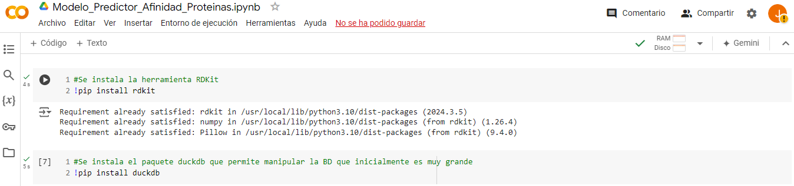

Para una correcta ejecución es necesario importar la base de datos desde Kaggle por lo que debe descargarse el archivo que llamado "kaggle.json" que se encuentra dentro de la carpeta fase-1. Tal como se puede ver en la siguiente imagen: 

Una vez se descarga el archivo se procede a la ejecución en Google Colab y este se carga posterior a la ejecución de la linea de comando files.upload() tal como se puede ver en las imagenes:

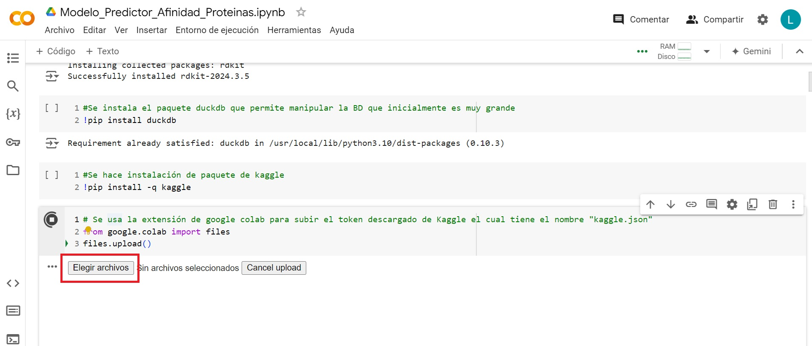

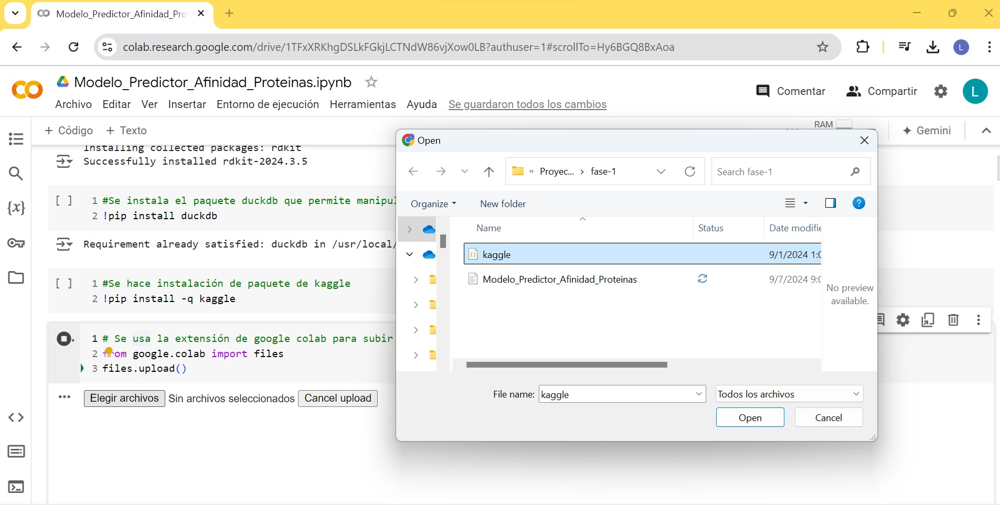

Posterior a la carga y lectura del archivo se puede acceder a la base de datos para su utilización en el proyecto.

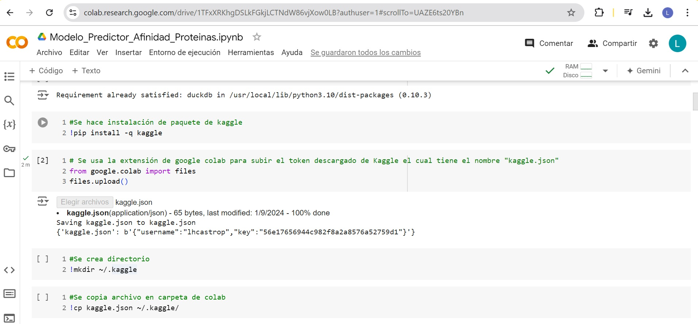

Luego de cargar la información se descomprimen los archivos en las carpetas creadas en COLAB

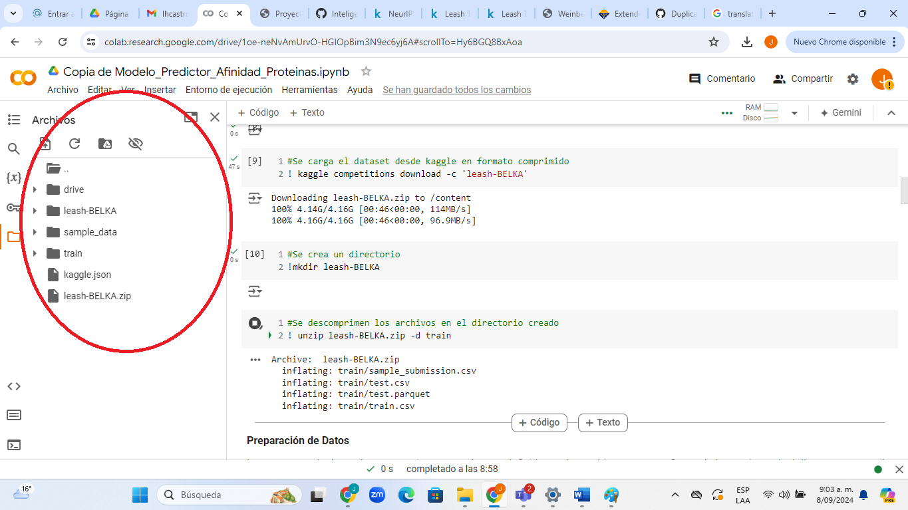

Una vez se tiene la información en carpetas, se procede a hacer la preparación de datos. Para esto se van a usar 30.000 Datos cuya salida sea 0, y 30.000 datos con salida 1; los cuales son de la base de datos con extensión .parquet

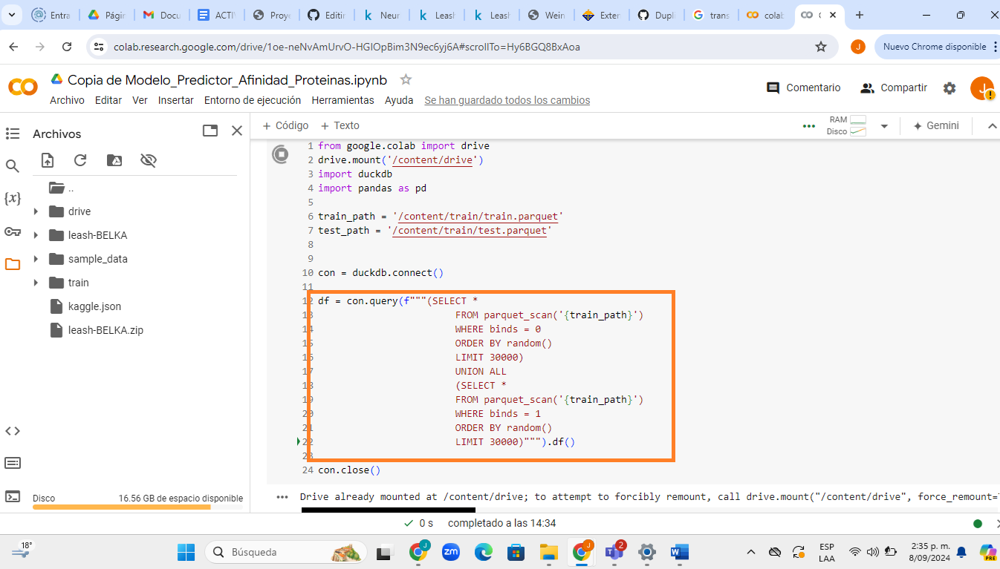

Una vez se tienen los datos, se van a obtener los SMILES almacenados en df, y se van a procesar con la ayuda de la herramienta rkdit: con el numero de SMILES se obtiene la molécula y posteriormente se obtiene el ecfp, con la ayuda de la misma herramienta.

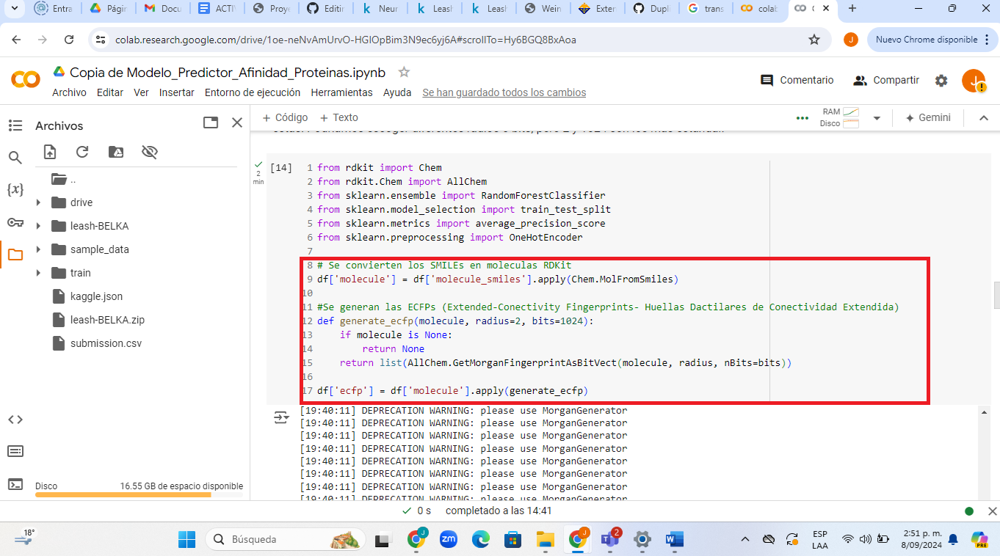

Los ECFP son identificadores de cada molecula, y dependiendo de la cantidad de radios pueden tener distintos identificadores:

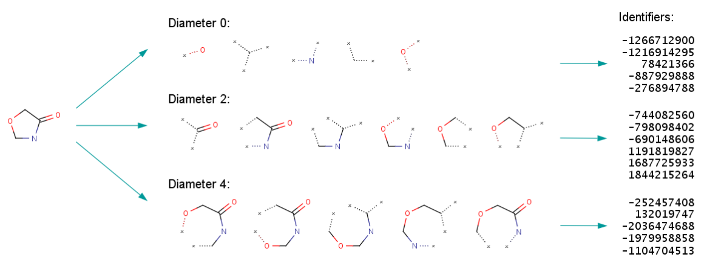

El siguiente paso es el entrenamiento del modelo. Para esto, primero se codifican las tres proteinas usando un encoder, y luego se hace combinación entre los ECFP ya obtenidos de las moleculas y las proteinas codificadas, para obtener la matriz de entrada X. Las salidas corresponden a las respectivas afinidades entre 0 y 1. Teniendo X y Y se entrena el modelo usando random Forest.

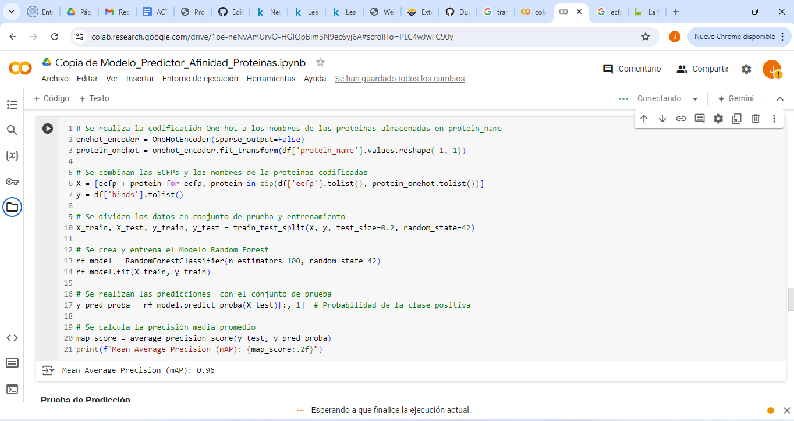

Luego se prueba el modelo, usando el archivo test.csv y el modelo ya obtenido. La salida es un archivo llamado submission.csv en el cual se obtienen los identificadores de las moleculas y las respectivas afinidades:

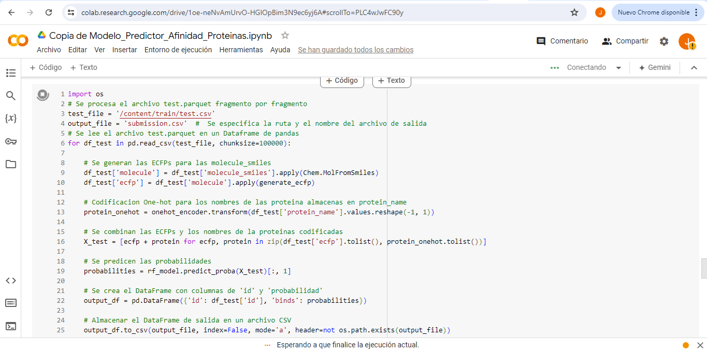

Finalmente, se obtienen los siguientes resultados:

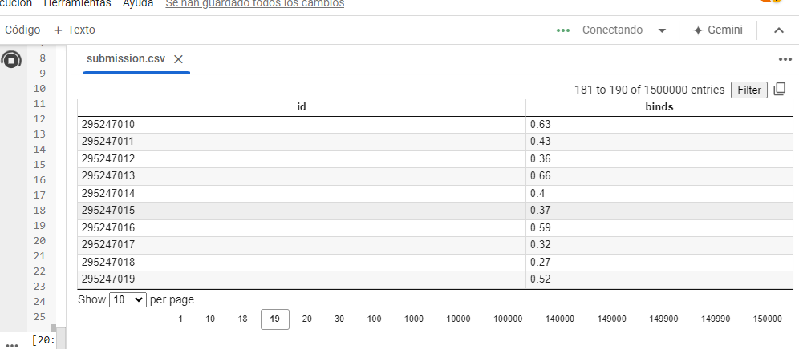

